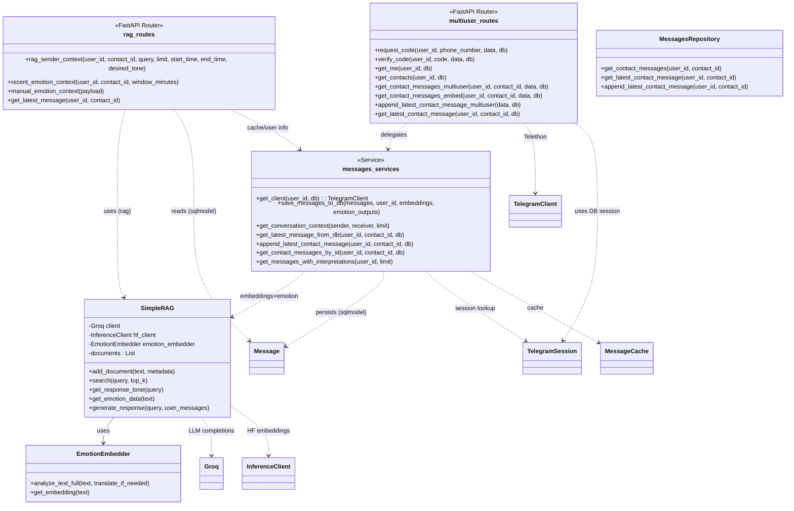

# Emoticoach System Class Diagram

This document provides a high-level class diagram for the Emoticoach system, split into Frontend (Flutter) and Backend (Python) components.

> Note: The diagram reflects the classes and relationships present in the provided code context. Some implementation details and auxiliary classes are omitted for clarity.

## Frontend (Flutter)

```mermaid
classDiagram
    direction TB

    class OverlayScreen {
      +bool messagingOverlayEnabled
      +bool messageAnalysisEnabled
      +bool smartSuggestionsEnabled
      +bool toneAdjusterEnabled
      +int _ragContextLimit
      +initState()
      +_loadSavedSettings()
      +_checkPermissions()
      +_saveSettings()
      +_initializeStatistics()
    }

    class ContactsListView {
      -TelegramService _telegramService
      +initState()
      +_loadContacts()
      +_loadTelegramContacts()
      +_handleContactTap(contact)
      +onContactSelected(contact) callback
    }

    class AnalysisView {
      -RagService _ragService
      -TelegramService _telegramService
      -bool _messageAnalysisEnabled
      -bool _smartSuggestionsEnabled
      -bool _toneAdjusterEnabled
      -String _latestMessage
      -Map _latestMessageDetails
      +initState()
      +_fetchMessages()
      +_analyzeEmotion(text)
      +_getToneForContact(contact)
      +_getInterpretationForContact(contact)
      +_getSuggestedResponseForContact(contact)
    }

    class EditOverlayScreen {
      -TelegramService _telegramService
      -RagService _ragService
      -TextEditingController _responseController
      -TextEditingController _shortenController
      +initState()
      +_fetchLatestMessage()
      +_generateResponse(instruction, showFeedback)
      +_applyToneToResponse(tone)
    }

    class TelegramService {
      +getMe(userId)
      +getContacts(userId)
      +getContactMessages(userId, contactId)
      +getLatestContactMessage(userId, contactId)
      +appendLatestContactMessage(userId, contactId)
    }

    class RagService {
      +getRecentEmotionContext(userId, contactId, limit)
      +generateContextualReply(userId, contactId, query, desiredTone)
    }

    class ManualAnalysisService { +analyzeMessage(userId, message) }
    class OverlayStatsService
    class OverlayStatsTracker {
      +initialize()
      +addListener(listener)
      +removeListener(listener)
      +getStatistics(period)
      +getDailyUsagePoints(period)
      +trackMessageAnalyzed(messageContent, analysisType)
    }

    class AuthUtils { +getSafeUserId() }

    OverlayScreen --> OverlayStatsTracker : listens
    OverlayScreen --> SharedPreferences : persists settings
    OverlayScreen ..> OverlayStatistics : displays

    ContactsListView --> TelegramService : uses
    ContactsListView ..> AuthUtils : resolves userId

    AnalysisView --> TelegramService : fetches messages
    AnalysisView --> RagService : emotion context
    AnalysisView ..> SharedPreferences : reads toggles
    AnalysisView ..> AuthUtils : resolves userId
    AnalysisView ..> OverlayStatsTracker : logs analysis

    EditOverlayScreen --> TelegramService : latest message
    EditOverlayScreen --> RagService : generates reply
    EditOverlayScreen ..> AuthUtils : resolves userId
```

## Backend (Python)

## Notes

- Frontend relies on SharedPreferences for persisting overlay settings.
- Latest message retrieval prefers DB-backed content (via `getLatestContactMessage`) to reuse stored interpretation/emotion when available.
- Emotion-aware reply generation is centralized in the backend RAG pipeline; caps output length with `max_tokens=400`.

## Viewing

- In VS Code, open this file and use the built-in Markdown preview (or install a Mermaid preview extension) to render the diagrams.
- Path: `docs/architecture/class-diagram.md`.
