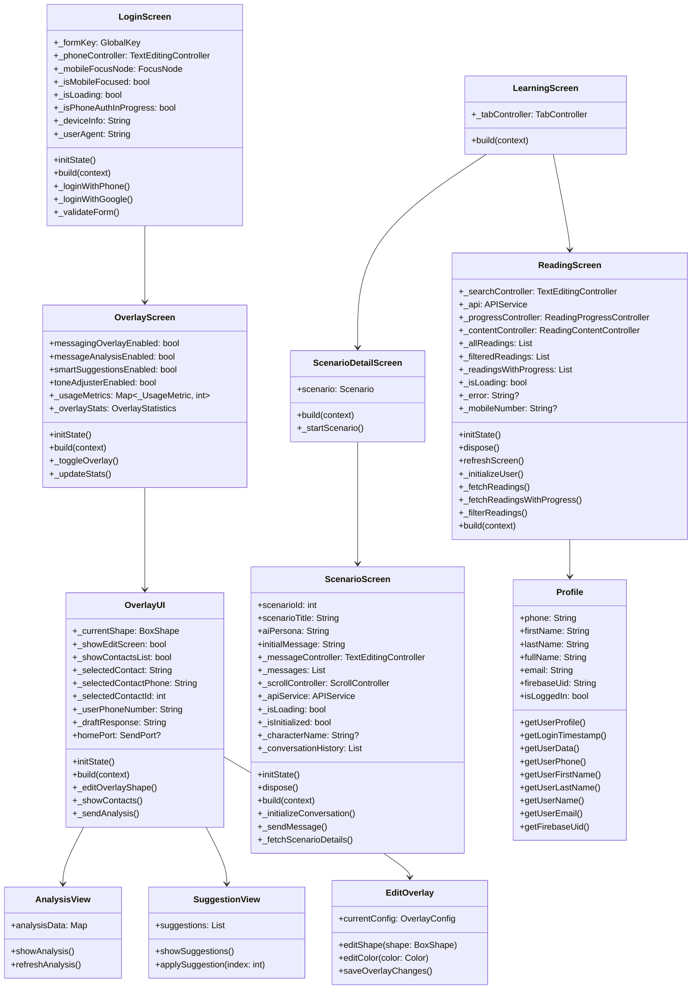

```mermaid
classDiagram
    class LoginScreen {
      +_formKey: GlobalKey<FormState>
      +_phoneController: TextEditingController
      +_mobileFocusNode: FocusNode
      +_isMobileFocused: bool
      +_isLoading: bool
      +_isPhoneAuthInProgress: bool
      +_deviceInfo: String
      +_userAgent: String
      +initState()
      +build(context)
      +_loginWithPhone()
      +_loginWithGoogle()
      +_validateForm()
    }

    class OverlayScreen {
      +messagingOverlayEnabled: bool
      +messageAnalysisEnabled: bool
      +smartSuggestionsEnabled: bool
      +toneAdjusterEnabled: bool
      +_usageMetrics: Map<_UsageMetric, int>
      +_overlayStats: OverlayStatistics
      +initState()
      +build(context)
      +_toggleOverlay()
      +_updateStats()
    }

    class OverlayUI {
      +_currentShape: BoxShape
      +_showEditScreen: bool
      +_showContactsList: bool
      +_selectedContact: String
      +_selectedContactPhone: String
      +_selectedContactId: int
      +_userPhoneNumber: String
      +_draftResponse: String
      +homePort: SendPort?
      +initState()
      +build(context)
      +_editOverlayShape()
      +_showContacts()
      +_sendAnalysis()
    }

    class AnalysisView {
      +analysisData: Map<String, dynamic>
      +showAnalysis()
      +refreshAnalysis()
    }

    class SuggestionView {
      +suggestions: List<String>
      +showSuggestions()
      +applySuggestion(index: int)
    }

    class EditOverlay {
      +currentConfig: OverlayConfig
      +editShape(shape: BoxShape)
      +editColor(color: Color)
      +saveOverlayChanges()
    }

    class LearningScreen {
      +_tabController: TabController
      +build(context)
    }

    class ScenarioDetailScreen {
      +scenario: Scenario
      +build(context)
      +_startScenario()
    }

    class ScenarioScreen {
      +scenarioId: int
      +scenarioTitle: String
      +aiPersona: String
      +initialMessage: String
      +_messageController: TextEditingController
      +_messages: List<ChatMessage>
      +_scrollController: ScrollController
      +_apiService: APIService
      +_isLoading: bool
      +_isInitialized: bool
      +_characterName: String?
      +_conversationHistory: List<ConversationMessage>
      +initState()
      +dispose()
      +build(context)
      +_initializeConversation()
      +_sendMessage()
      +_fetchScenarioDetails()
    }

    class ReadingScreen {
      +_searchController: TextEditingController
      +_api: APIService
      +_progressController: ReadingProgressController
      +_contentController: ReadingContentController
      +_allReadings: List<Reading>
      +_filteredReadings: List<Reading>
      +_readingsWithProgress: List<ReadingWithProgress>
      +_isLoading: bool
      +_error: String?
      +_mobileNumber: String?
      +initState()
      +dispose()
      +refreshScreen()
      +_initializeUser()
      +_fetchReadings()
      +_fetchReadingsWithProgress()
      +_filterReadings()
      +build(context)
    }

    class Profile {
      +phone: String
      +firstName: String
      +lastName: String
      +fullName: String
      +email: String
      +firebaseUid: String
      +isLoggedIn: bool
      +getUserProfile()
      +getLoginTimestamp()
      +getUserData()
      +getUserPhone()
      +getUserFirstName()
      +getUserLastName()
      +getUserName()
      +getUserEmail()
      +getFirebaseUid()
    }

    %% Relationships (simple chain + OverlayUI composition)
  LoginScreen --> OverlayScreen
  OverlayScreen --> OverlayUI
  OverlayUI --> AnalysisView
  OverlayUI --> SuggestionView
  OverlayUI --> EditOverlay
  %% Learning module navigation
  LearningScreen --> ScenarioDetailScreen
  ScenarioDetailScreen --> ScenarioScreen
  LearningScreen --> ReadingScreen
  ReadingScreen --> Profile
```
