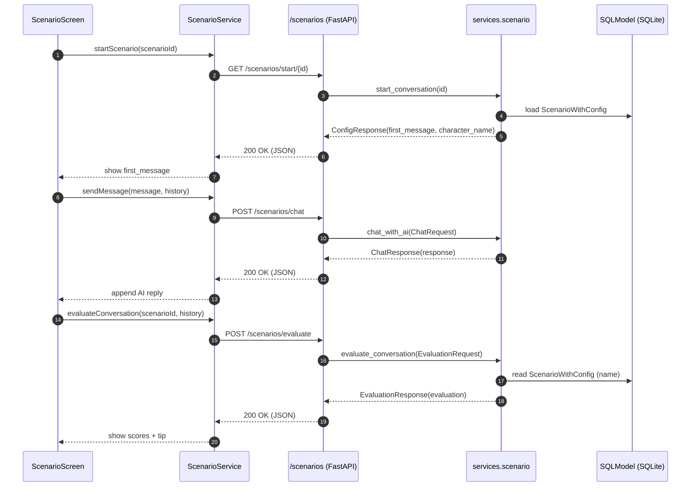

## Scenario Module Class Diagram

The diagram below focuses on the Scenario learning module: frontend models, UI screens, and service calls; backend routes, service functions, and data models.

```mermaid
classDiagram
    direction LR

    %% =====================
    %% Frontend
    %% =====================
    namespace Frontend.Models {
        class Scenario {
            +int id
            +String title
            +String description
            +String category
            +String difficulty
            +String? configFile
            +int? estimatedDuration
            +bool isActive
            +String formattedDuration
        }

        class ConversationMessage {
            +String role
            +String content
        }

        class ChatRequest {
            +String message
            +List~ConversationMessage~? conversationHistory
        }

        class ChatResponse {
            +bool success
            +String? response
            +String? characterName
            +String? error
        }

        class EvaluationRequest {
            +List~ConversationMessage~ conversationHistory
        }

        class EvaluationData {
            +int clarity
            +int empathy
            +int assertiveness
            +int appropriateness
            +String tip
        }

        class EvaluationResponse {
            +bool success
            +EvaluationData? evaluation
            +List~String~? userReplies
            +int? totalUserMessages
            +String? savedPath
            +String? error
        }

        class ConfigResponse {
            +bool success
            +String? characterName
            +String? firstMessage
            +bool? conversationStarted
            +String? error
        }

        class ConversationFlowResponse {
            +bool success
            +bool shouldEnd
            +double confidence
            +String reason
            +String? suggestedEndingMessage
            +Map~String,double~ conversationQuality
        }

        class CompletedScenario {
            +int scenarioId
            +String title
            +String description
            +String category
            +String difficulty
            +int? estimatedDuration
            +DateTime completedAt
            +int? completionTimeMinutes
            +int? finalClarityScore
            +int? finalEmpathyScore
            +int? finalAssertivenessScore
            +int? finalAppropriatenessScore
            +double? averageScore
            +int? userRating
            +int? totalMessages
            +int completionCount
        }
    }

    namespace Frontend.Services {
        class ScenarioService {
            +Future~List~ getScenarios()
            +Future~Map~ startScenario(scenarioId)
            +Future~Map~ getScenarioDetails(scenarioId)
            +Future~Map~ sendMessage(message, scenarioId, conversationHistory)
            +Future~Map~ evaluateConversation(scenarioId, conversationHistory)
            +Future~Map~ completeScenario(userId, scenarioId, ...)
            +Future~List~ getCompletedScenarios(userId)
        }
    }

    namespace Frontend.Screens {
        class LearningScreen
        class ScenarioDetailScreen
        class ScenarioScreen

        class ChatMessage {
            +String text
            +bool isUser
            +DateTime timestamp
        }

        class ChatBubble
        class CustomSendButton
        class CustomContinueButtonSmall
    }

    %% Relationships (Frontend)
    LearningScreen --> ScenarioService : loads list + completions
    ScenarioDetailScreen --> ScenarioService : startScenario()
    ScenarioScreen --> ScenarioService : sendMessage()/evaluate()
    ScenarioScreen --> ConversationMessage : uses
    ScenarioScreen --> ChatMessage : renders
    ScenarioService --> Scenario : maps list/details
    ScenarioService --> CompletedScenario : maps completions

    %% =====================
    %% Backend
    %% =====================
    namespace Backend.Models {
        class ScenarioWithConfig {
            +int id
            +String title
            +String description
            +String category
            +String difficulty
            +int estimated_duration
            +bool is_active
            +JSON character_config
            +String character_name
            +String character_description
            +String first_message
        }

        class ScenarioCompletion {
            +String scenario_completion_id
            +String user_id
            +int scenario_id
            +datetime completed_at
            +int? completion_time_minutes
            +int? clarity_score
            +int? empathy_score
            +int? assertiveness_score
            +int? appropriateness_score
            +int? user_rating
            +int? total_messages
            +datetime created_at
        }
    }

    namespace Backend.DTOs {
        class BE_ConversationMessage {
            +String role
            +String content
        }
        class BE_ChatRequest {
            +String message
            +int? scenario_id
            +String? character_name
            +String? character_description
            +List~BE_ConversationMessage~? conversation_history
        }
        class BE_ChatResponse {
            +bool success
            +String? response
            +String? character_name
            +String? error
        }
        class BE_EvaluationRequest {
            +List~BE_ConversationMessage~ conversation_history
            +int? scenario_id
        }
        class BE_EvaluationResponse {
            +bool success
            +Map evaluation
            +List~String~ user_replies
            +int total_user_messages
            +String saved_path
            +String? error
        }
        class BE_ConfigResponse {
            +bool success
            +int? scenario_id
            +String? scenario_title
            +String? character_name
            +String? first_message
            +bool? conversation_started
            +String? error
        }
    }

    namespace Backend.Services {
        class scenario_py {
            +chat_with_ai(BE_ChatRequest) BE_ChatResponse
            +evaluate_conversation(BE_EvaluationRequest) BE_EvaluationResponse
            +start_conversation(scenario_id) BE_ConfigResponse
            +get_available_scenarios() List
            +get_scenario_details(id) Map
            +load_config(scenario_id) Map
        }
    }

    namespace Backend.Routes {
        class scenario_router {
            <<FastAPI Router>>
            +GET /scenarios/start/{scenario_id}
            +POST /scenarios/chat
            +POST /scenarios/check-flow
            +POST /scenarios/evaluate
            +GET /scenarios/list
            +GET /scenarios/details/{scenario_id}
            +POST /scenarios/complete
            +GET /scenarios/completed/{user_id}
            +POST /scenarios/create
            +POST /scenarios/upload-yaml
        }
    }

    %% Relationships (Backend)
    scenario_router --> scenario_py : delegates
    scenario_py --> ScenarioWithConfig : reads
    scenario_router --> ScenarioCompletion : create/update + list

    %% Cross-layer mappings
    ScenarioService ..> scenario_router : HTTP
    ChatRequest .. Frontend.Models ..> BE_ChatRequest : payload shape
    ChatResponse .. Frontend.Models ..> BE_ChatResponse : response shape
    EvaluationRequest .. Frontend.Models ..> BE_EvaluationRequest
    EvaluationResponse .. Frontend.Models ..> BE_EvaluationResponse
    ConfigResponse .. Frontend.Models ..> BE_ConfigResponse
```

### Notes

- Frontend service endpoints map to Backend routes under the /scenarios prefix.
- The ScenarioWithConfig model embeds character configuration (name, description, first_message) in JSON.
- EvaluationData on the frontend is parsed from the backend’s evaluation JSON with safe fallbacks.
- Conversation flow check (/check-flow) uses a conversation tracker service to decide if a chat should end; it returns ConversationFlowResponse on the frontend.


